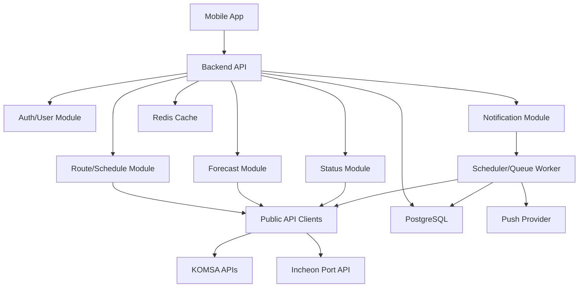

# 바다길 전체 아키텍처

## 1. 제품 정의

바다길은 섬 주민, 여행객, 가족 방문객, 터미널 이용객을 위한 여객선 실시간 운항, 시간표, 내일 운항예보, 항로, 알림 중심 앱이다.

핵심 문장:

> 오늘 배가 뜨는지, 내일 탈 수 있는지, 어느 항로로 가는지 알려주는 여객선 이동 안내 앱

## 2. 1차 MVP 범위

필수 기능:

- 출발지-도착지 기반 여객선 검색
- 오늘 운항상태 조회
- 날짜별 운항 스케줄 조회
- 내일 운항예보 및 상세 예보 조회
- 항로 및 기항지 정보 조회

권장 기능:

- 관심 항로, 선박 즐겨찾기
- 결항, 통제, 지연, 출항 임박 푸시 알림
- 터미널 지도 앱 연결

2차 이후 확장:

- 가족 공유 링크
- 섬 관광 정보
- 예매 페이지 연결
- AI 운항 요약
- 실시간 해상 교통지도

## 3. 권장 기술 스택

### 모바일 앱

- React Native + Expo
- TypeScript
- Expo Router
- TanStack Query
- Zustand
- NativeWind 또는 Tamagui
- Expo Notifications
- 지도 연동: 초기에는 외부 지도 앱 딥링크, 이후 Naver Map/Kakao Map SDK 검토

선정 이유:

- iOS/Android 동시 개발 속도가 빠르다.
- 푸시 알림, 딥링크, 로컬 저장소, 위치 권한 연동이 MVP에 적합하다.
- 국내 사용자를 대상으로 하는 앱이므로 네이티브 지도 SDK 확장 여지도 남길 수 있다.

### 백엔드

- Node.js + NestJS
- TypeScript
- PostgreSQL
- Redis
- Prisma
- BullMQ 또는 Nest Schedule
- Swagger/OpenAPI

선정 이유:

- 공공데이터 API 키 보호, XML/JSON 정규화, 캐싱, 알림 감지 로직을 서버에서 처리해야 한다.
- NestJS는 모듈 경계가 분명해 API 연계 모듈, 도메인 서비스, 알림 워커를 분리하기 좋다.
- Prisma는 초기 MVP의 데이터 모델링과 마이그레이션 속도가 좋다.

### 인프라

- 개발: Docker Compose(PostgreSQL, Redis)
- API 서버: Render/Fly.io/Railway 또는 AWS ECS/Fargate
- DB: Supabase/PostgreSQL Managed DB 또는 RDS
- 캐시/큐: Upstash Redis 또는 ElastiCache
- 푸시: Expo Push Notification에서 시작, 운영 단계에서 FCM/APNs 직접 연동 검토

## 4. 시스템 구성

## 5. 백엔드 모듈 구조

권장 모듈:

- `public-api`: KOMSA, 인천항만공사 API 클라이언트
- `normalizer`: 외부 API 응답을 앱 표준 JSON으로 변환
- `routes`: 항로, 운항항로, 기항지 정보
- `schedules`: 날짜별 운항 스케줄
- `statuses`: 오늘 운항상태, 선박별/항로별 상태
- `forecasts`: 내일 운항예보, 상세 예보
- `favorites`: 사용자 관심 항로/선박/터미널
- `notifications`: 알림 설정, 발송 이력, 상태 변경 감지
- `terminals`: 터미널 위치, 지도 앱 연결 정보
- `users`: 익명 사용자 또는 계정 기반 사용자

## 6. 모바일 앱 화면 구조

하단 탭:

- 홈
- 시간표
- 항로
- 예보
- 내 정보

핵심 플로우:

1. 사용자가 출발지와 도착지를 선택한다.
2. 앱이 오늘 운항상태, 다음 출항, 내일 예보를 한 화면에 보여준다.
3. 사용자는 상세 시간표, 항로/기항지, 알림 받기를 선택할 수 있다.
4. 관심 항로로 저장하면 상태 변경 및 예보 갱신 알림을 받을 수 있다.

## 7. 데이터 모델

### route

- `id`
- `license_route_code`
- `license_route_name`
- `operation_route_code`
- `operation_route_name`
- `provider`
- `updated_at`

### route_stop

- `id`
- `route_id`
- `stop_sequence`
- `port_code`
- `port_name`
- `latitude`
- `longitude`

### vessel

- `id`
- `vessel_code`
- `vessel_name`
- `passenger_capacity`
- `operator_name`
- `updated_at`

### sailing_schedule

- `id`
- `sailing_date`
- `departure_time`
- `departure_port_name`
- `arrival_port_name`
- `route_id`
- `vessel_id`
- `control_reason`
- `passenger_capacity`
- `status`
- `source`
- `updated_at`

### sailing_status

- `id`
- `schedule_id`
- `sailing_date`
- `vessel_name`
- `route_name`
- `status_code`
- `status_name`
- `delay_minutes`
- `control_reason`
- `source`
- `updated_at`

### sailing_forecast

- `id`
- `forecast_date`
- `route_id`
- `vessel_id`
- `forecast_status`
- `forecast_reason`
- `weather_summary`
- `risk_level`
- `source`
- `updated_at`

### user_favorite

- `id`
- `user_id`
- `favorite_type`
- `target_id`
- `notification_enabled`
- `created_at`

### notification_rule

- `id`
- `user_id`
- `favorite_id`
- `notify_status_change`
- `notify_departure_minutes_before`
- `notify_forecast_update`
- `created_at`
- `updated_at`

### notification_event

- `id`
- `user_id`
- `event_type`
- `title`
- `body`
- `payload`
- `sent_at`
- `created_at`

## 8. 외부 API 역할

| 기능 | 우선 API | 보조 API |
| --- | --- | --- |
| 오늘 운항상태 | KOMSA 여객선 운항상태 정보 | 인천항만공사 실시간 운항정보 |
| 인천항 국제여객터미널 현황 | 인천항만공사 실시간 운항정보 | KOMSA 스케줄 |
| 날짜별 시간표 | KOMSA 운항 스케줄 정보 | KOMSA 운항항로/운항노선 정보 |
| 항로 목록 | KOMSA 운항항로 정보 | KOMSA 운항노선 정보 |
| 기항지 순서 | KOMSA 운항노선 정보 | 기항지 위치 데이터 |
| 내일 운항 가능성 | KOMSA 내일의 운항예보 | KOMSA 내일의 운항예보 상세 |
| 해상 교통상황 | KOMSA 실시간 교통정보 조회 | 2차 기능으로 보류 |

## 9. 캐싱 및 장애 대응

공공데이터 API는 호출 제한, 응답 지연, 일시 중단 가능성이 있으므로 앱이 직접 호출하지 않는다.

캐시 정책:

- 항로/노선 기준 데이터: 24시간
- 날짜별 스케줄: 10-30분
- 오늘 운항상태: 1-5분
- 내일 예보: 30-60분
- API 장애 시 마지막 정상 응답과 갱신 시간을 함께 표시

앱 표시 원칙:

- 예보는 확정 운항정보가 아님을 명시한다.
- API 장애 시 "마지막 확인 시각"을 보여준다.
- 통제/결항/지연은 사용자가 이해하기 쉬운 문장으로 변환한다.

## 10. API 설계 초안

모바일 앱용 API:

- `GET /v1/ports`
- `GET /v1/routes`
- `GET /v1/routes/search?departure=&arrival=`
- `GET /v1/routes/:id`
- `GET /v1/routes/:id/stops`
- `GET /v1/schedules?departure=&arrival=&date=`
- `GET /v1/status/today?departure=&arrival=`
- `GET /v1/forecasts/tomorrow?departure=&arrival=`
- `GET /v1/favorites`
- `POST /v1/favorites`
- `DELETE /v1/favorites/:id`
- `GET /v1/notification-rules`
- `PATCH /v1/notification-rules/:id`

운영/동기화 API:

- `POST /internal/sync/routes`
- `POST /internal/sync/schedules`
- `POST /internal/sync/statuses`
- `POST /internal/sync/forecasts`

## 11. 디자인 방향

제품 톤:

- 신뢰감 있는 교통 안내 앱
- 지도/시간표/상태를 빠르게 스캔할 수 있는 조용한 UI
- "전문 용어"보다 "탈 수 있음, 주의, 확인 필요, 못 탐" 중심의 사용자 언어

상태 표현:

- 정상운항: 긍정 색상
- 운항예정: 중립 색상
- 지연: 주의 색상
- 결항/통제: 위험 색상
- 정보 없음/API 장애: 회색 + 마지막 갱신 시각

홈 화면 우선순위:

1. 출발지-도착지 검색
2. 오늘 운항 가능 여부
3. 다음 출항
4. 내일 예보
5. 알림 받기

