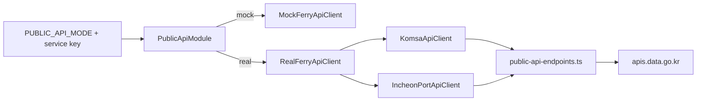

# Public Data API Registry

This project keeps each public data API as a fixed endpoint spec in
`apps/api/src/public-api/public-api-endpoints.ts`. Runtime configuration only
needs service keys, so endpoint URLs do not have to be copied into `.env` files.

## Runtime Mode

- `PUBLIC_API_MODE=mock`: use local mock data.
- `PUBLIC_API_MODE=real`: call data.go.kr APIs through `RealFerryApiClient`.

Use one shared key when possible:

```env
DATA_GO_KR_SERVICE_KEY=your-data-go-kr-key
```

Provider-specific keys are also supported and take precedence for their provider:

```env
KOMSA_SERVICE_KEY=your-komsa-key
INCHEON_PORT_SERVICE_KEY=your-incheon-port-key
```

Do not commit real keys. Put them in an ignored local env file.

## Registered APIs

| Service | Source | Endpoint | Operation | Format | App usage |
| --- | --- | --- | --- | --- | --- |
| Incheon passenger terminal realtime navigation | https://www.data.go.kr/data/15157686/openapi.do | `https://apis.data.go.kr/B551504/ipaFerryNavigatInfo` | `/getIntrlNvgList` | XML | Incheon terminal realtime supplement |
| KOMSA ferry route status | https://www.data.go.kr/data/15142304/openapi.do | `https://apis.data.go.kr/B554035/ferry-route-info-v4` | `/get-ferry-route-info-v4` | JSON/XML | Today route status |
| KOMSA operation schedule | https://www.data.go.kr/data/15142302/openapi.do | `https://apis.data.go.kr/B554035/oprt-schd-info-v2` | `/get-oprt-schd-info-v2` | JSON/XML | Sailing schedule search |
| KOMSA operation route | https://www.data.go.kr/data/15142301/openapi.do | `https://apis.data.go.kr/B554035/oprt-rt-info-v3` | `/get-oprt-rt-info-v3` | JSON | Route catalog |
| KOMSA tomorrow forecast | https://www.data.go.kr/data/15131259/openapi.do | `https://apis.data.go.kr/B554035/tmr-forecast` | `/get_tmr-forecast` | JSON | Tomorrow forecast summary |
| KOMSA realtime traffic | https://www.data.go.kr/data/15128233/openapi.do | `https://apis.data.go.kr/B554035/realtime` | `/get_realtime` | JSON/XML | Marine traffic raw data |
| KOMSA tomorrow forecast detail | https://www.data.go.kr/data/15144520/openapi.do | `https://apis.data.go.kr/B554035/tmr-forecastnew` | `/get_tmr_forecastnew` | JSON | Tomorrow forecast detail |
| KOMSA operation line | https://www.data.go.kr/data/15157337/openapi.do | `https://apis.data.go.kr/B554035/oprt-line-info-v2` | `/get-oprt-line-info-v2` | JSON/XML | Route stop/line detail |

## Adapter Flow



The normalized API surface remains unchanged for the rest of the backend:

- `GET /v1/routes`
- `GET /v1/routes/search`
- `GET /v1/routes/:id/stops`
- `GET /v1/schedules`
- `GET /v1/status/today`
- `GET /v1/forecasts/tomorrow`

## Required Parameters Found During Live Verification

Some public APIs are reachable but require domain-specific parameters before
they return data.

| API | Required parameters beyond key/paging |
| --- | --- |
| KOMSA operation schedule | `rlvtYmd`, `psnshpNm` |
| KOMSA ferry route status | `rlvtYmd` |
| KOMSA tomorrow forecast | `ilja` |
| KOMSA tomorrow forecast detail | `ilja` |
| Incheon terminal navigation | `skipRow`, `endRow` |

